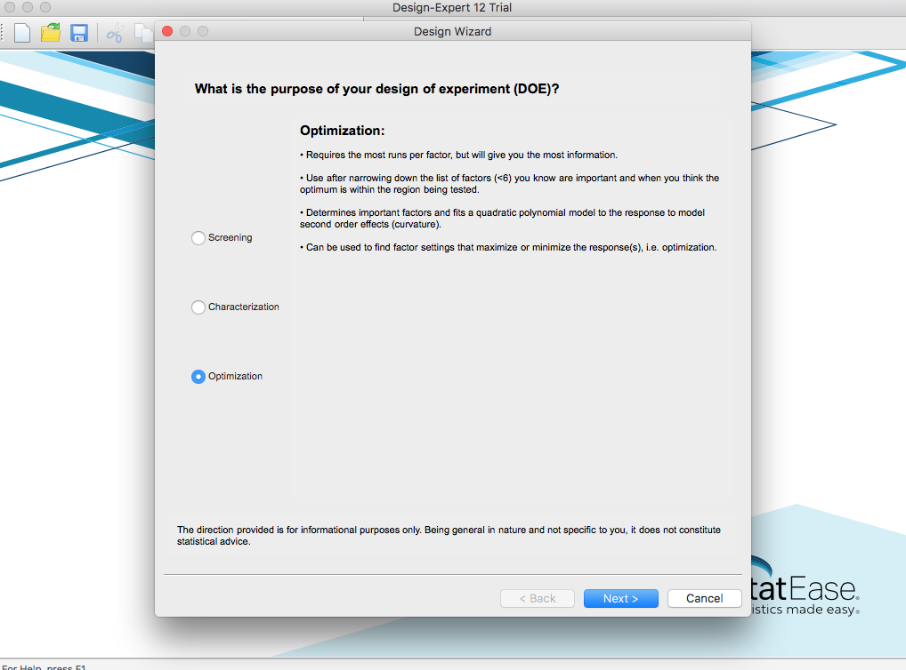

{}
Remarks and questions to be discussed
{}

From screening to optimization: from DSDs to BBDs and SCCDs there are many OMARS:

| #factors |         CCD |       SCCD |           BBD |      DSD |
| -------: | ----------: | ---------: | ------------: | -------: |
|        3 |    14 (4,6) |   10 (4,6) |      12 (4,8) |  8 (2,4) |
|        4 |    24 (6,8) |   16 (6,8) |    24 (12,20) |  8 (2,4) |
|        5 |   42 (8,10) |  26 (8,10) |    40 (20,36) | 12 (2,4) |
|        6 |  76 (10,12) | 44 (10,12) | 48 (24,32&40) | 12 (2,4) |
|        7 | 142 (12,14) | 78 (12,14) |    56 (32,48) | 16 (2,4) |

And also with 2-level factors and blocking factors we can make similar tables. 

####  Question 1: what are the most common goals for a practitioner?

* Screening
* Knowledge discovery
* Optimization 

Are there more?

Another question: How many times have you been involved in a follow-up experiment?

 

#### Question 2: comment on DE approach

They have three options:
##### 1. Screening: 

##### 2. LE / Characterization: 2FI 

##### 3. Optimization: SOE

 

#### Question 3: do you think that the following situation occurs in practice?

​        An engineer wants to study 10 quantitative factors, but only wants to be able to estimate quadratic effects on 6 of them, as the other 4 are known to have little or no impact. In this case, some of the factors are 3-level and some are 2-level (and all quantitative). 

 

#### Question 4: how bad is not having split-plot or mixture designs?

 

#### Question 5: how can we relate the statistical quality of a design with objectives that a practitioner can understand? How do they relate to the 

* Quality of estimation (D-,A-efficiencies…)? 
* Quality of prediction (I-,G-efficiencies…)?
* Projection capabilities? Power? 4th order correlation?

 

#### Question 6: given that we have a positive answer to the previous question, how would you combine the quality indicators?

#### Question 7: we have implemented the utopia method for design selection, any other way to choose?

#### Question 8: do you consider replication in screening experiments?

The are OMARS designs with different replicates than the center point. Even for a low number of runs compared to the number of factors. 

#### Question 9: comment on the following guidelines by Coleman and Montgomery[^first]

|    | item                                             | comments |
|----|--------------------------------------------------|----------|
| 1  | name, organization, department, title experiment |          |
| 2  | responsible for the experiment coordination      |          |
| 3  | objectives                                       |          |
| 4  | relevant background                              |          |
| 5  | response variables                               |          |
| 6  | control variables                                |          |
| 7  | factors to be "held constant"                    |          |
| 8  | nuisance factors                                 |          |
| 9  | interactions                                     |          |
| 10 | restrictions in factor levels                    |          |
| 11 | restrictions in randomization                    |          |
| 12 | gage R&R study?                                  |          |
| 13 | screening experiment?                            |          |
| 14 | follow-up experiment?                            |          |

[^first]: Coleman, D., & Montgomery, D. (1993). A Systematic Approach to Planning for a Designed Industrial Experiment. Technometrics, 35(1), 1-12. doi:[10.2307/1269280](https://www.jstor.org/stable/1269280?seq=1 "get the article! (if you have the right permissions!)")

 

 